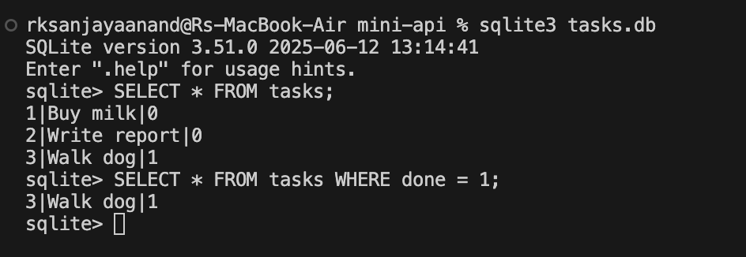

# mini-api

A minimal FastAPI backend for managing tasks, now backed by a real SQLite database instead of an in-memory list.

## Endpoints

| Method | Path                          | Description                              |
|--------|-------------------------------|-------------------------------------------|
| GET    | `/health`                     | Returns server status                     |
| GET    | `/hello`                      | Returns a greeting (optional `name`)      |
| GET    | `/tasks`                      | List all tasks (optional `search`, `done`)|
| GET    | `/tasks/{id}`                 | Get a single task                         |
| POST   | `/tasks`                      | Create a task                             |
| PUT    | `/tasks/{id}`                 | Update a task                             |
| DELETE | `/tasks/{id}`                 | Delete a task                             |
| GET    | `/stats`                      | Total/done/pending task counts            |

## Why SQLite

SQLite was chosen because it needs no separate database server — the whole database lives in a single file (`tasks.db`) in the project folder. That makes it ideal for a small learning project: no setup, no credentials, and the file is created automatically the first time the app runs. The API itself didn't change at all when moving from an in-memory list to SQLite — only the storage layer underneath it did.

## Where the database lives

`tasks.db` is created automatically in the project's root directory the first time the server starts. The `tasks` table is created if it doesn't exist, and three example tasks are inserted only on the very first run (the table stays empty-check gated after that, so restarts don't duplicate data).

## Setup

```bash
python3 -m venv venv
source venv/bin/activate
pip install -r requirements.txt
```

## Run

```bash
uvicorn main:app --reload
```

Server runs at `http://127.0.0.1:8000`. On first run, `tasks.db` is created in the project folder with 3 seed tasks.

## Test

```bash
curl http://127.0.0.1:8000/tasks
curl -X POST http://127.0.0.1:8000/tasks -H "Content-Type: application/json" -d '{"title": "Buy groceries"}'
curl http://127.0.0.1:8000/tasks/1
curl -X PUT http://127.0.0.1:8000/tasks/1 -H "Content-Type: application/json" -d '{"done": true}'
curl -X DELETE http://127.0.0.1:8000/tasks/1
curl http://127.0.0.1:8000/stats
```

Or open in browser:
- `http://127.0.0.1:8000/docs` (interactive Swagger UI)

## Inspecting the database

```bash
sqlite3 tasks.db
```

Example query run during development:

```sql
SELECT * FROM tasks WHERE done = 1;
```

This returns only the completed task(s) — confirmed against `tasks.db` in the terminal below:



## Tech

FastAPI + Uvicorn + SQLite (via Python's built-in `sqlite3` module)